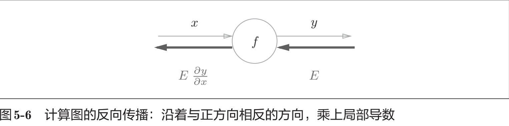
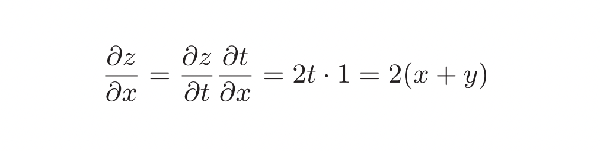
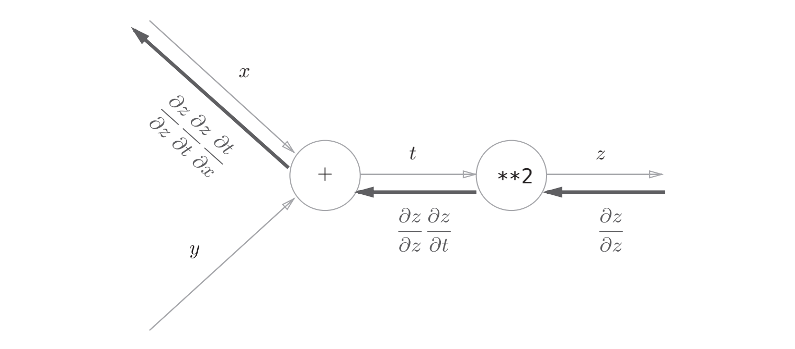
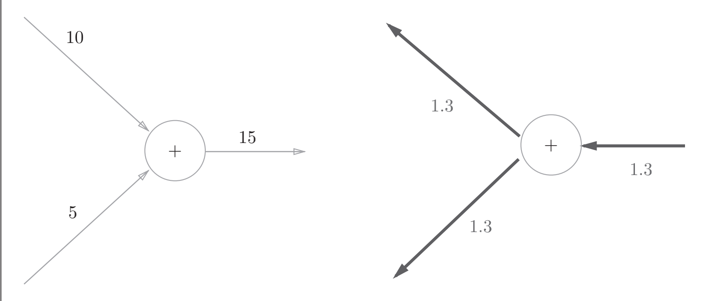
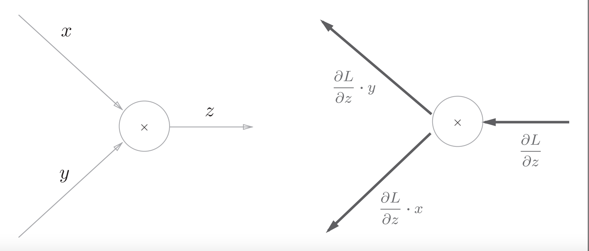

## Chapter5: 误差反向传播法（backward propagation）
### 一，计算图（computational graph）
#### （一）计算图定义
>计算图：将计算过程用图形表示出来
#### （二）局部计算
* 1，计算图的特征是可以通过传递“局部计算”获得最终结果。
* 2，“局部”这个词的意思是“与自己相关的某个小范围”。局部计算是指，无论全局发生了什么，都能只根据与自己相关的信息输出接下来的结果。
* 3，无论全局的计算有多么复杂，各个步骤所要做的就是对象节点的局部计算。虽然局部计算非常简单，但是通过传递它的计算结果，可以获得全局的复杂计算的结果。
### 二，链式法则（chain rule）
#### （一）计算图反向传播

* 把这个局部导数乘以上游传过来的值（本例中为E），然后传递给前面的节点。
* 通过这样的计算，可以高效地求出导数的值，这是反向传播的要点。
#### （二）链式法则

* 1，链式法则是关于复合函数的导数的性质，定义如下：
* 2，如果某个函数由复合函数表示，则该复合函数的导数可以用构成复合函数的各个函数的导数的乘积表示。
* 3，计算图的反向传播从右到左传播信号。反向传播的计算顺序是，先将节点的输入信号乘以节点的局部导数（偏导数），然后再传递给下一个节点。

### 三，反向传播（Backward Propagation）
#### （一）加法节点反向传播
* 1，因为加法节点的反向传播只乘以1，所以输入的值会原封不动地流向下一个节点。

#### （二）乘法节点反向传播
* 1，乘法的反向传播会将上游的值乘以正向传播时的输入信号的“翻转值”后传递给下游。翻转值表示一种翻转关系，正向传播时信号是x的话，反向传播时则是y；正向传播时信号是y的话，反向传播时则是x。

#### （三）比较
* 1，加法的反向传播只是将上游的值传给下游，并不需要正向传播的输入信号。
* 2，但是，乘法的反向传播需要正向传播时的输入信号值。因此，实现乘法节点的反向传播时，要保存正向传播的输入信号。