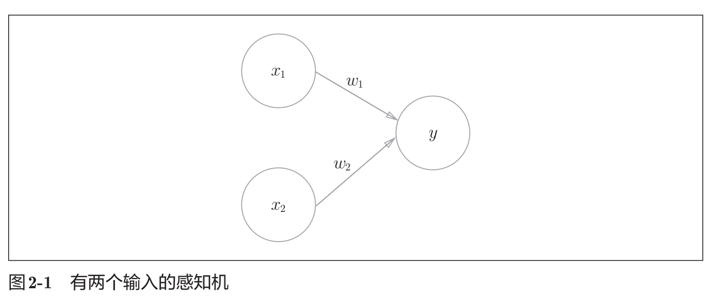
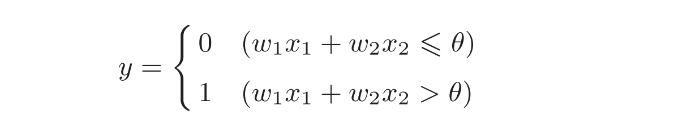

## 感知机（perceptron）

### （一）定义
* 输入信号被送往神经元时，会被分别乘以固定的权重（w1x1、w2x2）。神经元会计算传送过来的信号的总和，只有当这个总和超过了某个界限值时，才会输出1。这也称为“神经元被激活”。这里将这个界限值称为阈值，用符号θ表示。
* 数学公式：

### （二）感知机python实现
#### 1, 与门(AND)
~~~py
def AND(x1, x2):
    x = np.array([x1, x2])
    w = np.array([0.5, 0.5])
    b = -0.7
    tmp = np.sum(w*x) + b
    if tmp <= 0:
        return 0
    else:
        return 1
~~~
#### 2, 或门(OR)
~~~py
def OR(x1, x2):
    x = np.array([x1, x2])
    w = np.array([-0.5, -0.5]) # 仅权重和偏置与AND不同！
    b = -0.2
    tmp = np.sum(w*x) + b
    if tmp <= 0:
        return 0
    else:
        return 1
~~~
#### 3, 与非门(NAND)
~~~py
def NAND(x1, x2):
    x = np.array([x1, x2])
    w = np.array([-0.5, -0.5]) # 仅权重和偏置与AND不同！
    b = 0.7
    tmp = np.sum(w*x) + b
    if tmp <= 0:
        return 0
    else:
        return 1
~~~
#### 4, 异或门(XOR)
~~~py
def XOR(x1, x2):
    s1 = NAND(x1, x2)
    s2 = OR(x1, x2)
    y = AND(s1, s2)
    return y
~~~
### （三）感知机小结
* 感知机是具有输入和输出的算法。给定一个输入后，将输出一个既定的值。
• 感知机将权重和偏置设定为参数。
• 使用感知机可以表示与门和或门等逻辑电路。
• 异或门无法通过单层感知机来表示，使用2层感知机可以表示异或门。
• 单层感知机只能表示线性空间，而多层感知机可以表示非线性空间。
• 多层感知机（在理论上）可以表示计算机。
