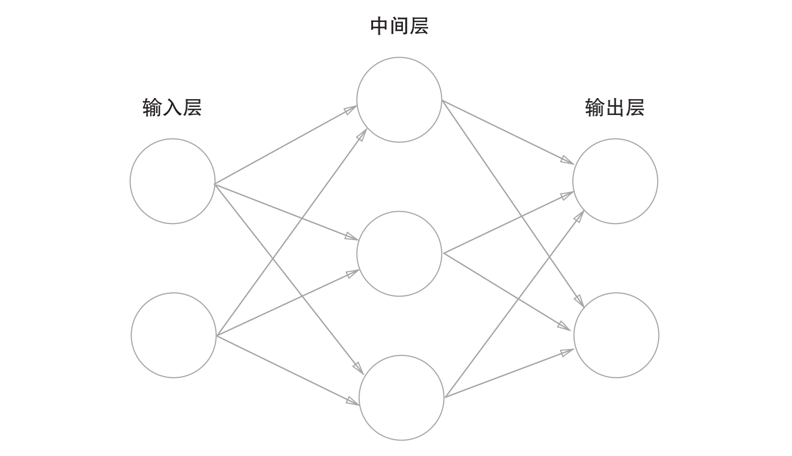
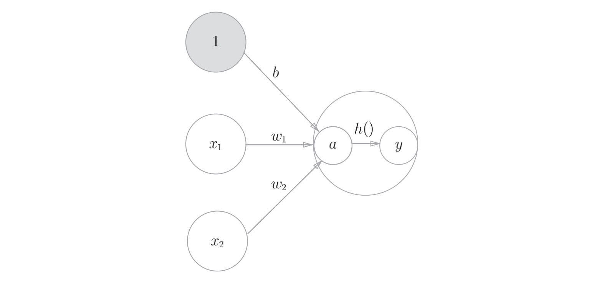
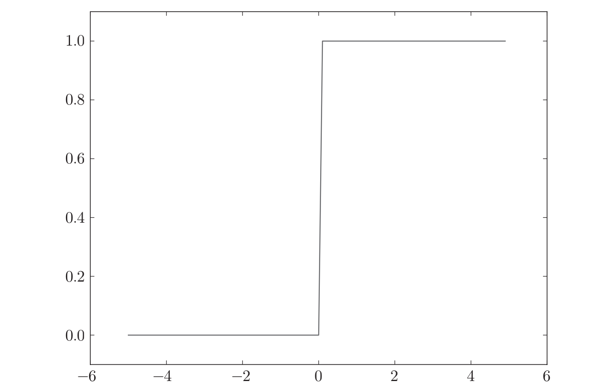
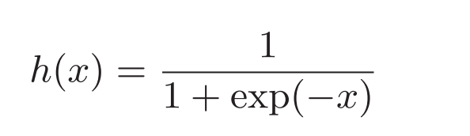
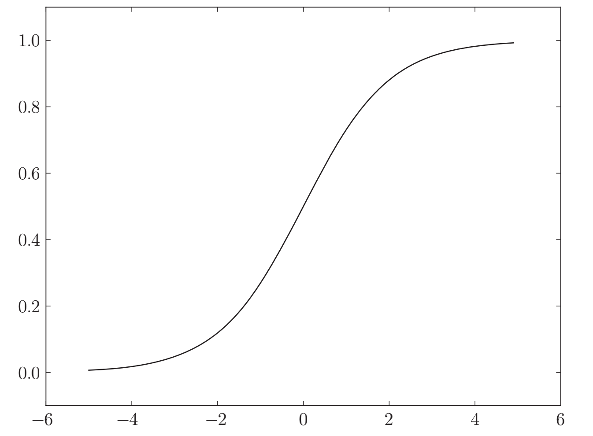
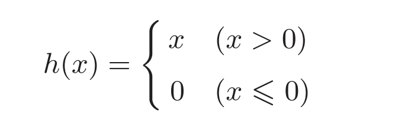
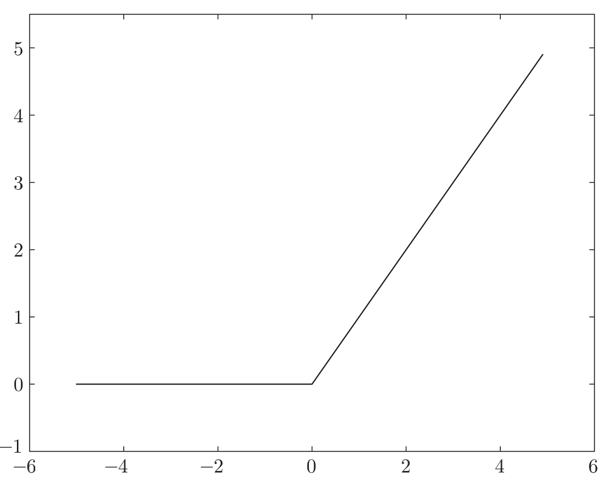
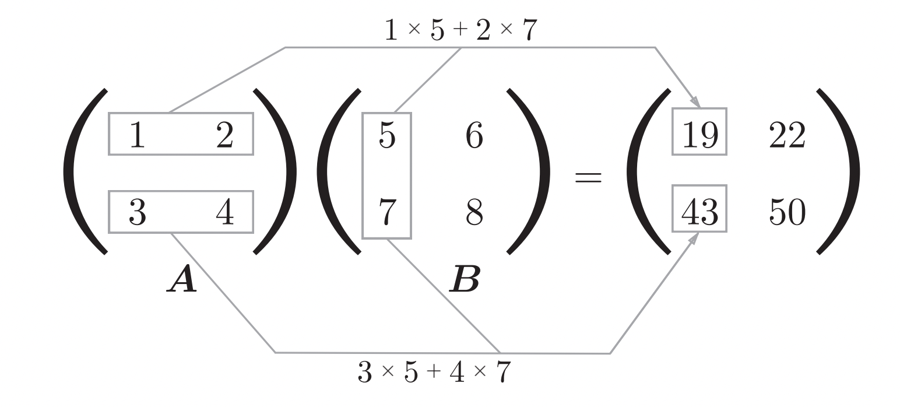
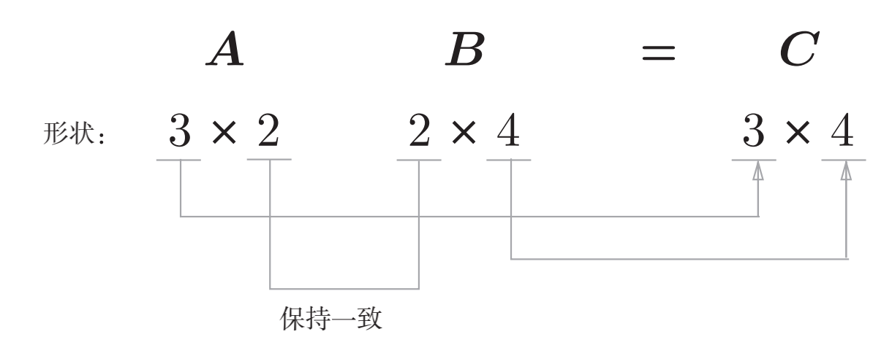

# 神经网络（Neural Net Work）
## 一，神经网络定义

## 二，激活函数（activate function）
### （一）定义
* 会将输入信号的总和转换为输出信号，这种函数一般称为激活函数（activation function）。
* 激活函数的作用在于决定如何来激活输入信号的总和。
* 激活过程：

### （二）阶跃函数
>激活函数以阈值为界，一旦输入超过阈值，就切换输出。这样的函数称为“阶跃函数”。

#### 1，阶跃函数python实现
~~~py
def step_function(x):
    y = x > 0
    return y.astype(np.int)
~~~
#### 2，阶跃函数绘图python实现
~~~py
import numpy as np
import matplotlib.pylab as plt
def step_function(x):
    return np.array(x > 0, dtype=np.int)
x = np.arange(-5.0, 5.0, 0.1)
y = step_function(x)
plt.plot(x, y)
plt.ylim(-0.1, 1.1) # 指定y轴的范围
plt.show()
~~~

### （三）sigmoid函数（sigmoid function）
* 公式

* 图形

#### 1，python实现sigmoid函数及其绘制
~~~py
def sigmoid(x):
    return 1 / (1 + np.exp(-x))
x = np.arange(-5.0, 5.0, 0.1)
y = sigmoid(x)
plt.plot(x, y)
plt.ylim(-0.1, 1.1) # 指定y轴的范围
plt.show()
~~~
#### 2，阶跃函数 VS sigmoid函数
* （1）不同点
* * “平滑性”的不同：sigmoid函数是一条平滑的曲线，输出随着输入发生连续性的变化。阶跃函数以0为界，输出发生急剧性的变化。sigmoid函数的平滑性对神经网络的学习具有重要意义。
* * 返回值不同：阶跃函数只能返回0或1，sigmoid函数可以返
回0.731 ...、0.880 ...等实数。也就是说，感知机中神经元之间流动的是0或1的二元信号，而神经网络中流动的是连续的实数值信号。
* （2）相同点
* * 当输入信号为重要信息时，阶跃函数和sigmoid函数都会输出较大的值；当输入信号为不重要的信息时，两者都输出较小的值。
* * 不管输入信号有多小，或者有多大，输出信号的值都在0到1之间。

### （四）ReLU函数（Rectified Linear Unit）
#### 1，定义
* ReLU函数在输入大于0时，直接输出该值；在输入小于等于0时，输出0。
* 公式：

* 图形：

#### 2，ReLU函数python实现
~~~py
def relu(x):
    return np.maximum(0, x)
~~~

## 三，神经网络内积运算
### （一）矩阵乘法
#### 1，矩阵乘法运算示意图

#### 2，python实现矩阵内积
~~~py
>>> A = np.array([[1,2], [3,4]])
>>> A.shape
(2, 2)
>>> B = np.array([[5,6], [7,8]])
>>> B.shape
(2, 2)
>>> np.ndim(B) # 查看矩阵维度
2
>>> np.dot(A, B)
array([[19, 22],
 [43, 50]])
~~~
#### 3，矩阵乘法规律

* 矩阵A * 矩阵B == 矩阵C：
* * （1）A的列(1 Axis)必须与B的行(0 Axis)相等
* * （2）矩阵C的维度 = （A矩阵的行，B矩阵的列）
