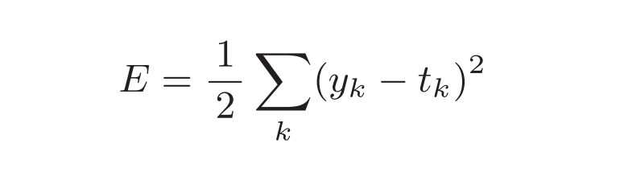
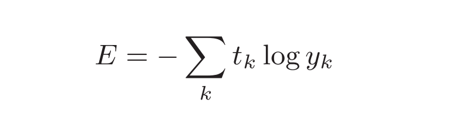
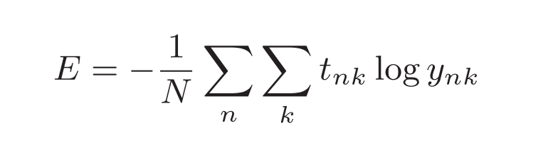
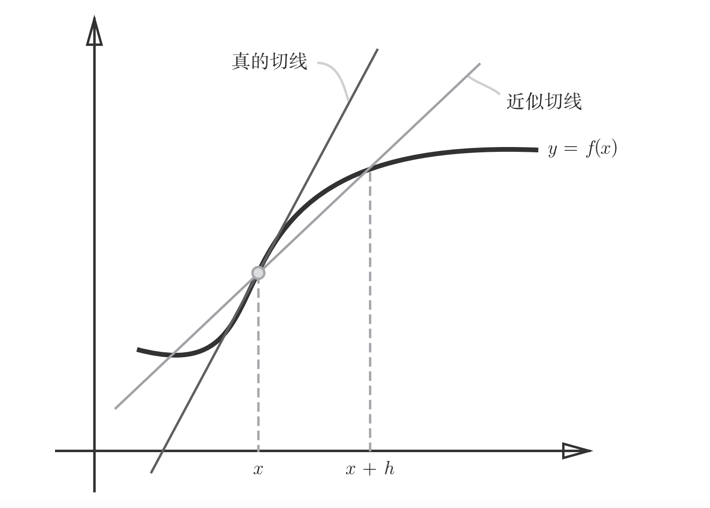

## Chapter4 神经网络的学习

### 一，从数据中学习
#### （一）数据驱动
* 深度学习有时也称为端到端机器学习（end-to-end machinelearning）。这里所说的端到端是指从一端到另一端的意思，也就是从原始数据（输入）中获得目标结果（输出）的意思。
* 神经网络的优点是对所有的问题都可以用同样的流程来解决。
#### （二）训练数据与测试数据
* 使用训练数据进行学习，寻找最优的参数；使用测试数据评价训练得到的模型的实际能力，训练数据也可以称为监督数据。
* 泛化能力是指处理未被观察过的数据（不包含在训练数据中的数据）的能力。获得泛化能力是机器学习的最终目标。
* 只对某个数据集过度拟合的状态称为过拟合（over fitting）

### 二，损失函数（Loss Function）
* 损失函数是表示神经网络性能的“恶劣程度”的指标，即当前的神经网络对监督数据在多大程度上不拟合，在多大程度上不一致。
* 以“性能的恶劣程度”为指标可能会使人感到不太自然，但是如果给损失函数乘上一个负值，就可以解释为“在多大程度上不坏”，即“性能有多好”。
* 并且，“使性能的恶劣程度达到最小”和“使性能的优良程度达到最大”是等价的，不管是用“恶劣程度”还是“优良程度”，做的事情本质上都是一样的。
* 使用训练数据进行学习，严格来说，就是针对训练数据计算损失函数的值，找出使该值尽可能小的参数。
#### （一）均方误差（mean squared error）
* 公式：

* python实现：
~~~py
def mean_squared_error(y, t):
    return 0.5 * np.sum((y-t)**2)
~~~
#### （二）交叉熵误差（cross entropy error）
* 公式：

* python实现：
~~~py
def cross_entropy_error(y, t):
    delta = 1e-7
    return -np.sum(t * np.log(y + delta))
~~~
#### （三）平均损失函数
* 把求单个数据的损失函数的式（4.2）扩大到了N份数据，不过最后还要除以N进行正规化。通过除以N，可以求单个数据的“平均损失函数”。
* 通过这样的平均化，可以获得和训练数据的数量无关的统一指标。
* 公式：

* mini-batch版交叉熵误差的python实现
~~~py
#--- 当监督数据是one-hot表示时（即仅正确解标签为1，其余为0的数据结构）----
def cross_entropy_error(y, t):
    if y.ndim == 1:
    t = t.reshape(1, t.size)
    y = y.reshape(1, y.size)
    batch_size = y.shape[0]
    return -np.sum(t * np.log(y + 1e-7)) / batch_size
#---当监督数据是标签形式（非one-hot表示，而是像“2”“7”这样的标签）时----
def cross_entropy_error(y, t):
    if y.ndim == 1:
    t = t.reshape(1, t.size)
    y = y.reshape(1, y.size)
    batch_size = y.shape[0]
    return -np.sum(np.log(y[np.arange(batch_size), t] + 1e-7)) / batch_size
~~~
#### （四）为何要设定损失函数
* 对该权重参数的损失函数求导，表示的是“如果稍微改变这个权重参数的值，损失函数的值会如何变化”。
* 如果导数的值为负，通过使该权重参数向正方向改变，可以减小损失函数的值；反过来，如果导数的值为正，则通过使该权重参数向负方向改变，可以减小损失函数的值。当导数的值为0时，无论权重参数向哪个方向变化，损失函数的值都不会改变，此时该权重参数的更新会停在此处。
* 不能用识别精度作为指标，因为绝大多数地方的导数都会变为0，导致参数无法更新。识别精度对微小的参数变化基本上没有什么反应，即便有反应，它的值也是不连续地、突然地变化。

### 三，数值微分（numerical differentiation）
>利用微小的差分求导数的过程称为数值微分（numerical differentiation）
#### （一）导数
* 导数就是表示某个瞬间的变化量。
* 公式：

* 中心差分与前向差分示意图

* python实现：
~~~py
#为了减小这个误差，我们可以计算函数f在(x + h)和(x − h)之间的差分。因为这种计算方法以x为中心，计算它左右两边的差分，所以也称为中心差分（而(x + h)和x之间的差分称为前向差分）。
def numberic_diff(f, x):
    h = 1e-4 # 0.0001
    return (f(x+h) - f(x-h)) / (2*h)
~~~
#### （二）偏导数
* 偏导数：有多个变量的函数的导数称为偏导数。
* 偏导数求导：需要将多个变量中的某一个变量定为目标变量，并将其他变量固定为某个值。
* python实现：
~~~py
def numerical_gradient(f, x):
    h = 1e-4 # 0.0001
    grad = np.zeros_like(x) # 生成和x形状相同的数组
    for idx in range(x.size):
    tmp_val = x[idx]
    # f(x+h)的计算
    x[idx] = tmp_val + h
    fxh1 = f(x)
    # f(x-h)的计算
    x[idx] = tmp_val - h
    fxh2 = f(x)
    grad[idx] = (fxh1 - fxh2) / (2*h)
    x[idx] = tmp_val # 还原值
    return grad
~~~ij

### 四，梯度（gradient）
> 这样的由全部变量的偏导数汇总而成的向量称为梯度（gradient）。
#### （一）梯度法
* 在梯度法中，函数的取值从当前位置沿着梯度方向前进一定距离，然后在新的地方重新求梯度，再沿着新梯度方向前进，如此反复，不断地沿梯度方向前进。
* 通过不断地沿梯度方向前进，逐渐减小函数值的过程就是梯度法（gradient method）。梯度法是解决机器学习中最优化问题的常用方法，特别是在神经网络的学习中经常被使用。
* 根据目的是寻找最小值还是最大值，梯度法的叫法有所不同。严格地讲，寻找最小值的梯度法称为梯度下降法（gradient descent method），寻找最大值的梯度法称为梯度上升法（gradient ascent method）。
* 通过反转损失函数的符号，求最小值的问题和求最大值的问题会变成相同的问题，因此“下降”还是“上升”的差异本质上并不重要。
#### （二）函数与梯度法
* 1, 函数的极小值、最小值以及被称为鞍点（saddle point）的地方，梯度为0。极小值是局部最小值，也就是限定在某个范围内的最小值。
* 2, 鞍点是从某个方向上看是极大值，从另一个方向上看则是极小值的点。虽然梯度法是要寻找梯度为0的地方，但是那个地方不一定就是最小值（也有可能是极小值或者鞍点）。
* 3, 此外，当函数很复杂且呈扁平状时，学习可能会进入一个（几乎）平坦的地区，陷入被称为“学习高原”的无法前进的停滞期。
* 4, python实现梯度下降法
~~~py
def gradient_descent(f, init_x, lr=0.01, step_num=100):
    x = init_x
    for i in range(step_num):
    grad = numerical_gradient(f, x)
    x -= lr * grad
    return x
~~~