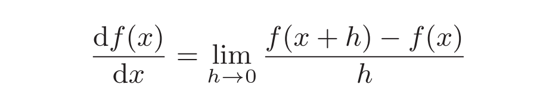

> ## Chapter4 神经网络的学习

### 一，从数据中学习

#### （一）数据驱动

* 深度学习有时也称为端到端机器学习（end-to-end machinelearning）。这里所说的端到端是指从一端到另一端的意思，也就是从原始数据（输入）中获得目标结果（输出）的意思。
* 神经网络的优点是对所有的问题都可以用同样的流程来解决。

#### （二）训练数据与测试数据

* 使用训练数据进行学习，寻找最优的参数；使用测试数据评价训练得到的模型的实际能力，训练数据也可以称为监督数据。
* 泛化能力是指处理未被观察过的数据（不包含在训练数据中的数据）的能力。获得泛化能力是机器学习的最终目标。
* 只对某个数据集过度拟合的状态称为过拟合（over fitting）

### 二，损失函数（Loss Function）

* 损失函数是表示神经网络性能的“恶劣程度”的指标，即当前的神经网络对监督数据在多大程度上不拟合，在多大程度上不一致。
* 以“性能的恶劣程度”为指标可能会使人感到不太自然，但是如果给损失函数乘上一个负值，就可以解释为“在多大程度上不坏”，即“性能有多好”。
* 并且，“使性能的恶劣程度达到最小”和“使性能的优良程度达到最大”是等价的，不管是用“恶劣程度”还是“优良程度”，做的事情本质上都是一样的。
* 使用训练数据进行学习，严格来说，就是针对训练数据计算损失函数的值，找出使该值尽可能小的参数。

#### （一）均方误差（mean squared error）

* 公式：
* python实现：

```py
def mean_squared_error(y, t):
    return 0.5 * np.sum((y-t)**2)
```

#### （二）交叉熵误差（cross entropy error）

* 公式：
* python实现：

```py
def cross_entropy_error(y, t):
    delta = 1e-7
    return -np.sum(t * np.log(y + delta))
```

#### （三）平均损失函数

* 把求单个数据的损失函数的式（4.2）扩大到了N份数据，不过最后还要除以N进行正规化。通过除以N，可以求单个数据的“平均损失函数”。
* 通过这样的平均化，可以获得和训练数据的数量无关的统一指标。
* 公式：
* mini-batch版交叉熵误差的python实现

```py
#--- 当监督数据是one-hot表示时（即仅正确解标签为1，其余为0的数据结构）----
def cross_entropy_error(y, t):
    if y.ndim == 1:
    t = t.reshape(1, t.size)
    y = y.reshape(1, y.size)
    batch_size = y.shape[0]
    return -np.sum(t * np.log(y + 1e-7)) / batch_size
#---当监督数据是标签形式（非one-hot表示，而是像“2”“7”这样的标签）时----
def cross_entropy_error(y, t):
    if y.ndim == 1:
    t = t.reshape(1, t.size)
    y = y.reshape(1, y.size)
    batch_size = y.shape[0]
    return -np.sum(np.log(y[np.arange(batch_size), t] + 1e-7)) / batch_size
```

#### （四）为何要设定损失函数

* 对该权重参数的损失函数求导，表示的是“如果稍微改变这个权重参数的值，损失函数的值会如何变化”。
* 如果导数的值为负，通过使该权重参数向正方向改变，可以减小损失函数的值；反过来，如果导数的值为正，则通过使该权重参数向负方向改变，可以减小损失函数的值。当导数的值为0时，无论权重参数向哪个方向变化，损失函数的值都不会改变，此时该权重参数的更新会停在此处。
* 不能用识别精度作为指标，因为绝大多数地方的导数都会变为0，导致参数无法更新。识别精度对微小的参数变化基本上没有什么反应，即便有反应，它的值也是不连续地、突然地变化。

### 三，数值微分（numerical differentiation）

> 利用微小的差分求导数的过程称为数值微分（numerical differentiation）

#### （一）导数

* 导数就是表示某个瞬间的变化量。
* 公式：
* 中心差分与前向差分示意图
* python实现：

```py
#为了减小这个误差，我们可以计算函数f在(x + h)和(x − h)之间的差分。因为这种计算方法以x为中心，计算它左右两边的差分，所以也称为中心差分（而(x + h)和x之间的差分称为前向差分）。
def numberic_diff(f, x):
    h = 1e-4 # 0.0001
    return (f(x+h) - f(x-h)) / (2*h)
```

#### （二）偏导数

* 偏导数：有多个变量的函数的导数称为偏导数。
* 偏导数求导：需要将多个变量中的某一个变量定为目标变量，并将其他变量固定为某个值。
* python实现：

```py
def numerical_gradient(f, x):
    h = 1e-4 # 0.0001
    grad = np.zeros_like(x) # 生成和x形状相同的数组
    for idx in range(x.size):
        tmp_val = x[idx]
        # f(x+h)的计算
        x[idx] = tmp_val + h
        fxh1 = f(x)
        # f(x-h)的计算
        x[idx] = tmp_val - h
        fxh2 = f(x)
        grad[idx] = (fxh1 - fxh2) / (2*h)
        x[idx] = tmp_val # 还原值
    return grad
```

### 四，梯度（gradient）

> 这样的由全部变量的偏导数汇总而成的向量称为梯度（gradient）。

#### （一）梯度法

* 1, 在梯度法中，函数的取值从当前位置沿着梯度方向前进一定距离，然后在新的地方重新求梯度，再沿着新梯度方向前进，如此反复，不断地沿梯度方向前进。
* 2, 通过不断地沿梯度方向前进，逐渐减小函数值的过程就是梯度法（gradient method）。梯度法是解决机器学习中最优化问题的常用方法，特别是在神经网络的学习中经常被使用。
* 3, 根据目的是寻找最小值还是最大值，梯度法的叫法有所不同。严格地讲，寻找最小值的梯度法称为梯度下降法（gradient descent method），寻找最大值的梯度法称为梯度上升法（gradient ascent method）。
* 4, 通过反转损失函数的符号，求最小值的问题和求最大值的问题会变成相同的问题，因此“下降”还是“上升”的差异本质上并不重要。

#### （二）函数与梯度法

##### 1，鞍点（saddle point）

* 1, 函数的极小值、最小值以及被称为鞍点（saddle point）的地方，梯度为0。极小值是局部最小值，也就是限定在某个范围内的最小值。
* 2, 鞍点是从某个方向上看是极大值，从另一个方向上看则是极小值的点。虽然梯度法是要寻找梯度为0的地方，但是那个地方不一定就是最小值（也有可能是极小值或者鞍点）。
* 3, 此外，当函数很复杂且呈扁平状时，学习可能会进入一个（几乎）平坦的地区，陷入被称为“学习高原”的无法前进的停滞期。
* 4, python实现梯度下降法

```py
def gradient_descent(f, init_x, lr=0.01, step_num=100):
    x = init_x
    for i in range(step_num):
        grad = numerical_gradient(f, x)
        x -= lr * grad
    return x
#参数f是要进行最优化的函数：
#1，init_x是初始值，lr是学习率learning rate，step_num是梯度法的重复次数。
#2，numerical_gradient(f,x)会求函数的梯度，用该梯度乘以学习率得到的值进行更新操作。
#3，由step_num指定重复的次数。
```

##### 2，学习率（η）

* （1）η表示更新量，在神经网络的学习中，称为学习率（learning rate）。学习率决定在一次学习中，应该学习多少，以及在多大程度上更新参数。在神经网络的学习中，一般会一边改变学习率的值，一边确认学习是否正确进行了。
* （2）实验结果表明，学习率过大的话，会发散成一个很大的值；反过来，学习率过小的话，基本上没怎么更新就结束了，设定合适的学习率是一个很重要的问题。
* （3）像学习率这样的参数称为超参数。这是一种和神经网络的参数（权重和偏置）性质不同的参数。相对于神经网络的权重参数是通过训练数据和学习算法自动获得的，学习率这样的超参数则是人工设定的。一般来说，超参数需要尝试多个值，以便找到一种可以使学习顺利进行的设定。

#### （三）神经网络的梯度

* 1，神经网络的学习也要求梯度，这里所说的梯度是指损失函数关于权重参数的梯度。

##### 1，python实现简单神经网络

```py
import sys, os
sys.path.append(os.pardir)
import numpy as np
from common.functions import softmax, cross_entropy_error
from common.gradient import numerical_gradient
class simpleNet:
    def __init__(self):
    self.W = np.random.randn(2,3) # 用高斯分布进行初始化
    def predict(self, x):
        return np.dot(x, self.W)

    def loss(self, x, t):
        z = self.predict(x)
        y = softmax(z)
        loss = cross_entropy_error(y, t)
        return loss

def f(W):
    return net.loss(x, t)
dW = numerical_gradient(f, net.W)
>>> print(dW)
[[ 0.21924763 0.14356247 -0.36281009]
 [ 0.32887144 0.2153437 -0.54421514]]
# 1，这表示如果将w11增加h，那么损失函数的值会增加0.2h。
# 2，再如，对应的值大约是−0.5，这表示如果将w23增加h，损失函数的值将减小0.5h。
# 3，因此，从减小损失函数值的观点来看，w23应向正方向更新，w11应向负方向更新。
# 4，至于更新的程度，w23比w11的贡献要大。
```

### 五，学习算法的实现

* 1，“学习”：神经网络存在合适的权重和偏置，调整权重和偏置以便拟合训练数据的过程称为学习。
* 2，随机梯度下降法（SGD, stochastic gradient descent）：因为使用的数据是随机选择的mini-batch数据。

#### （一）学习步骤

* 1，步骤1（mini-batch）
  &emsp;从训练数据中随机选出一部分数据，这部分数据称为mini-batch，我们的目标是减小mini-batch的损失函数的值。
* 2，步骤2（计算梯度）
  &emsp;为了减小mini-batch的损失函数的值，需要求出各个权重参数的梯度，梯度表示损失函数的值减小最多的方向。
* 3，步骤3（更新参数）
  &emsp;将权重参数沿梯度方向进行微小更新。
* 4，步骤4（重复）
  &emsp;重复步骤1、步骤2、步骤3。

#### （二）python实现2层神经网络的类

```py
import sys, os
sys.path.append(os.pardir)
from common.functions import *
from common.gradient import numerical_gradient
class TwoLayerNet:
    def __init__(self, input_size, hidden_size, output_size,
    weight_init_std=0.01):
    # 初始化权重
        self.params = {}
        self.params['W1'] = weight_init_std * \
        np.random.randn(input_size, hidden_size)
        self.params['b1'] = np.zeros(hidden_size)
        self.params['W2'] = weight_init_std * \
        np.random.randn(hidden_size, output_size)
        self.params['b2'] = np.zeros(output_size)

    def predict(self, x):
        W1, W2 = self.params['W1'], self.params['W2']
        b1, b2 = self.params['b1'], self.params['b2']
        a1 = np.dot(x, W1) + b1
        z1 = sigmoid(a1)
        a2 = np.dot(z1, W2) + b2
        y = softmax(a2)
        return y
    # x:输入数据, t:监督数据
    def loss(self, x, t):
        y = self.predict(x)
        return cross_entropy_error(y, t)
        def accuracy(self, x, t):
        y = self.predict(x)
        y = np.argmax(y, axis=1)
        t = np.argmax(t, axis=1)
        accuracy = np.sum(y == t) / float(x.shape[0])
        return accuracy
    # x:输入数据, t:监督数据
    def numerical_gradient(self, x, t):
        loss_W = lambda W: self.loss(x, t)
        grads = {}
        grads['W1'] = numerical_gradient(loss_W, self.params['W1'])
        grads['b1'] = numerical_gradient(loss_W, self.params['b1'])
        grads['W2'] = numerical_gradient(loss_W, self.params['W2'])
        grads['b2'] = numerical_gradient(loss_W, self.params['b2'])
        return grads
```

#### （三）mini-batch的实现

```py
# 读入数据
(x_train, t_train), (x_test, t_test) = load_mnist(normalize=True, one_hot_label=True)

network = TwoLayerNet(input_size=784, hidden_size=50, output_size=10)

# 超参数
iters_num = 10000  # 适当设定循环的次数
train_size = x_train.shape[0]
batch_size = 100
learning_rate = 0.1

train_loss_list = []
train_acc_list = []
test_acc_list = []

iter_per_epoch = max(train_size / batch_size, 1)

for i in range(iters_num):
    # 获取mini-batch
    batch_mask = np.random.choice(train_size, batch_size)
    x_batch = x_train[batch_mask]
    t_batch = t_train[batch_mask]
  
    # 计算梯度
    #grad = network.numerical_gradient(x_batch, t_batch)
    grad = network.gradient(x_batch, t_batch)
  
    # 更新参数
    for key in ('W1', 'b1', 'W2', 'b2'):
        network.params[key] -= learning_rate * grad[key]
  
    loss = network.loss(x_batch, t_batch)
    train_loss_list.append(loss)
    # 计算每个epoch的识别精度
    if i % iter_per_epoch == 0:
        train_acc = network.accuracy(x_train, t_train)
        test_acc = network.accuracy(x_test, t_test)
        train_acc_list.append(train_acc)
        test_acc_list.append(test_acc)
        print("train acc, test acc | " + str(train_acc) + ", " + str(test_acc))
```

#### （四）基于测试数据的评价

* 1，神经网络的学习中，必须确认是否能够正确识别训练数据以外的其他数据，即确认是否会发生过拟合。
* 2，过拟合是指虽然训练数据中的数字图像能被正确辨别，但是不在训练数据中的数字图像却无法被识别的现象。
* 3，神经网络学习的最初目标是掌握泛化能力，因此，要评价神经网络的泛化能力，就必须使用不包含在训练数据中的数据。
* 4，每经过一个epoch，我们都会记录下训练数据和测试数据的识别精度。
* 5，epoch是一个单位。一个 epoch表示学习中所有训练数据均被使用过一次时的更新次数。比如，对于 10000笔训练数据，用大小为 100笔数据的mini-batch进行学习时，重复随机梯度下降法 100次，所有的训练数据就都被“看过”了。

### 五，小结

* 机器学习中使用的数据集分为训练数据和测试数据。
* 神经网络用训练数据进行学习，并用测试数据评价学习到的模型的泛化能力。
* 神经网络的学习以损失函数为指标，更新权重参数，以使损失函数的值减小。
* 利用某个给定的微小值的差分求导数的过程，称为数值微分。
* 利用数值微分，可以计算权重参数的梯度。
* 数值微分虽然费时间，但是实现起来很简单。
