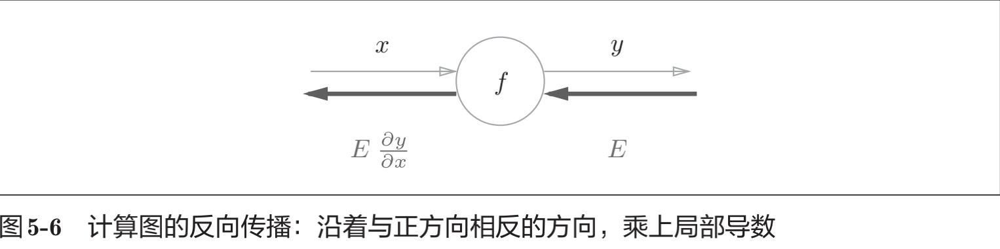
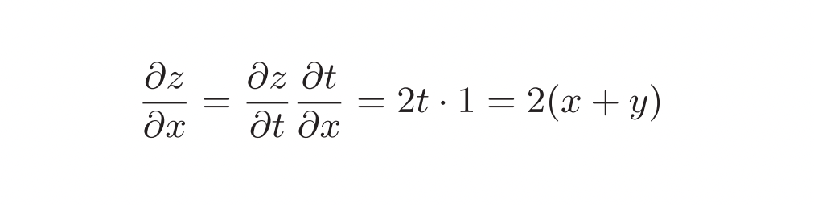
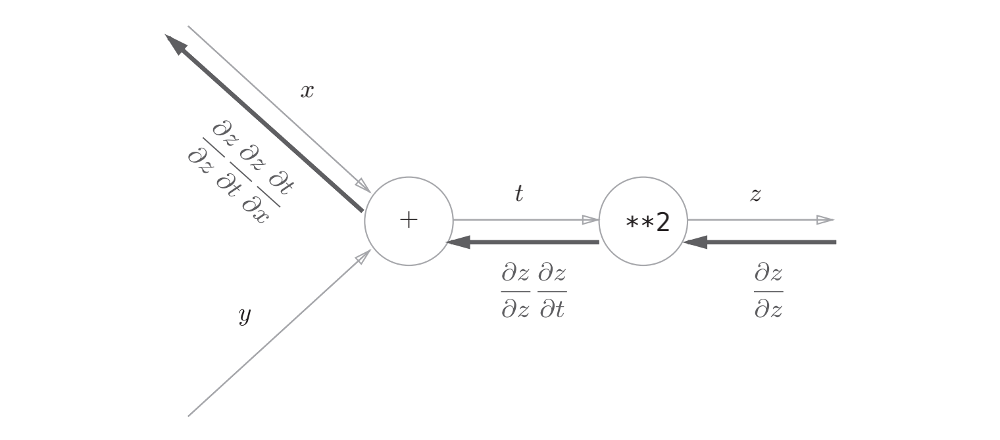
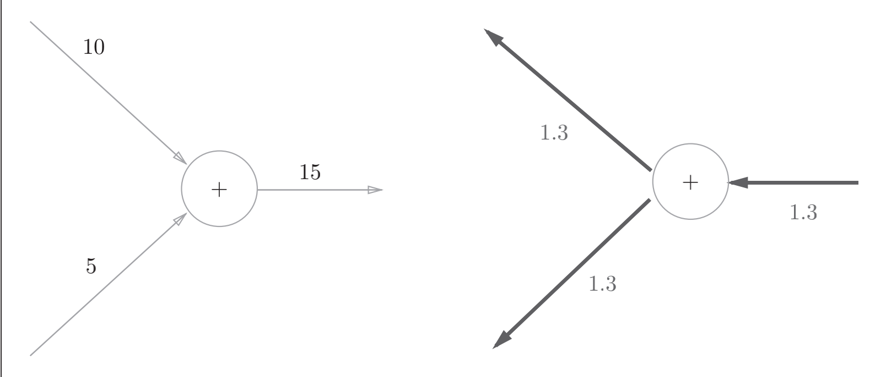
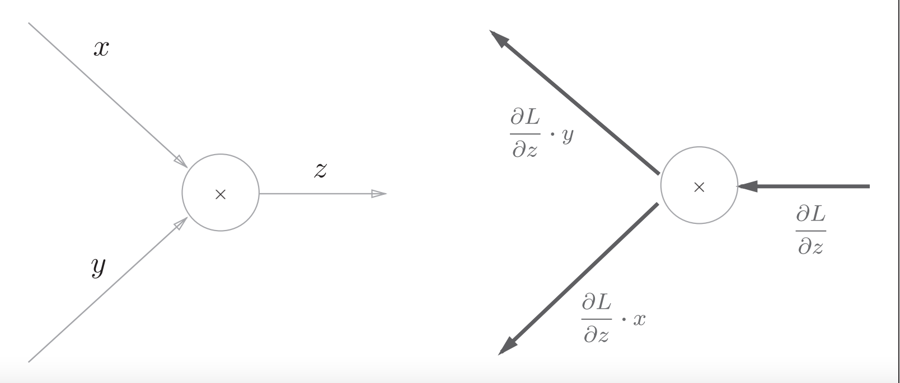
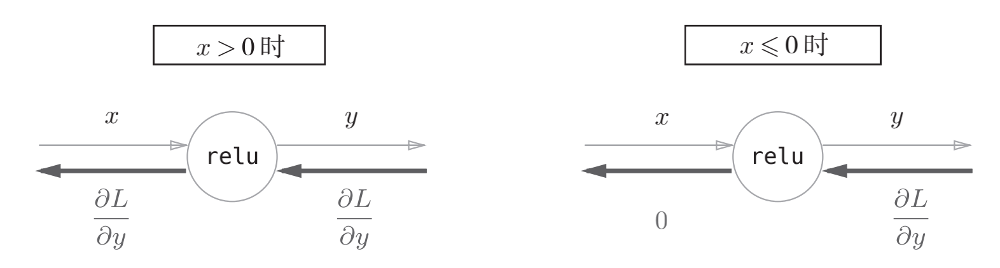
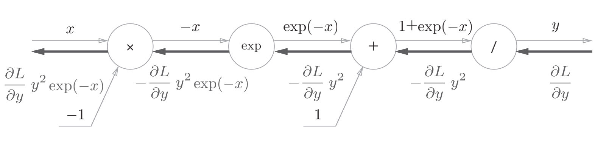
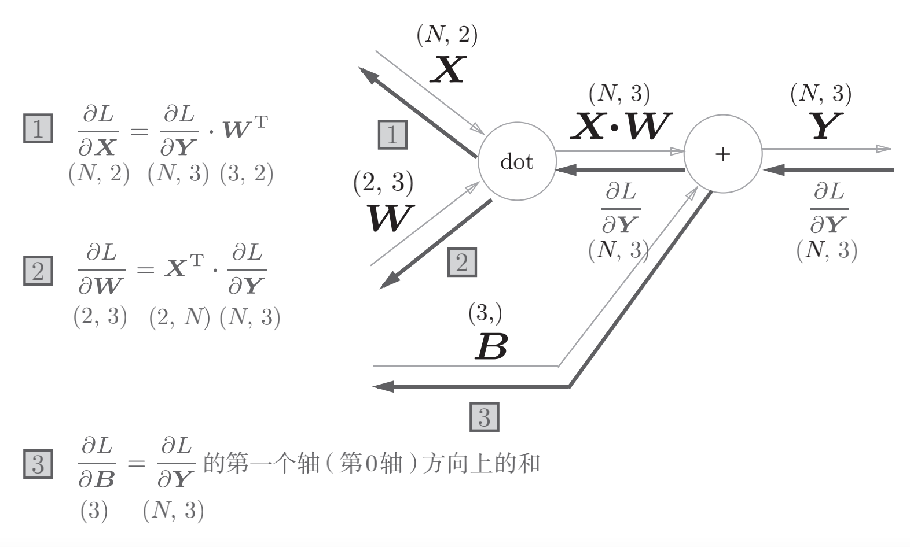
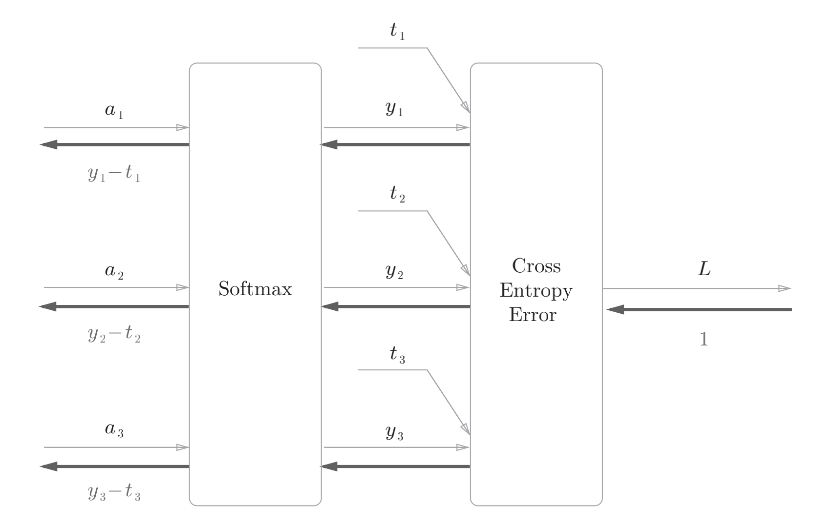

## Chapter5: 误差反向传播法（backward propagation）
### 一，计算图（computational graph）
#### （一）计算图定义
>计算图：将计算过程用图形表示出来
* 1，正向传播（forward propagation）：“从左向右进行计算”是一种正方向上的传播，正向传播是从计算图出发点到结束点的传播。
* 2，反向传播（backward propagation）：考虑反向（从图上看的话，就是从右向左）的传播。
* 3，局部计算：无论全局发生了什么，都能只根据与自己相关的信息输出接下来的结果。

#### （二）局部计算
* 1，计算图的特征是可以通过传递“局部计算”获得最终结果。
* 2，“局部”这个词的意思是“与自己相关的某个小范围”。局部计算是指，无论全局发生了什么，都能只根据与自己相关的信息输出接下来的结果。
* 3，无论全局的计算有多么复杂，各个步骤所要做的就是对象节点的局部计算。虽然局部计算非常简单，但是通过传递它的计算结果，可以获得全局的复杂计算的结果。

#### （三）计算图的优势
* 1，计算图可以集中精力于局部计算。无论全局的计算有多么复杂，各个步骤所要做的就是对象节点的局部计算。计算图将复杂的计算分割成简单的局部计算，和流水线作业一样，将局部计算的结果传递给下一个节点。
* 2，优点就在于前面所说的局部计算。无论全局是多么复杂的计算，都可以通过局部计算使各个节点致力于简单的计算，从而简化问题。
* 3，另一个优点是，利用计算图可以将中间的计算结果全部保存起来。
* 4，实际上，使用计算图最大的原因是，可以通过反向传播高效计算导数。

### 二，链式法则（chain rule）
#### （一）计算图反向传播

* 把这个局部导数乘以上游传过来的值（本例中为E），然后传递给前面的节点。
* 通过这样的计算，可以高效地求出导数的值，这是反向传播的要点。

#### （二）链式法则

* 1，链式法则是关于复合函数的导数的性质，定义如下：
* 2，如果某个函数由复合函数表示，则该复合函数的导数可以用构成复合函数的各个函数的导数的乘积表示。
* 3，计算图的反向传播从右到左传播信号。反向传播的计算顺序是，先将节点的输入信号乘以节点的局部导数（偏导数），然后再传递给下一个节点。

### 三，反向传播（Backward Propagation）
#### （一）加法节点反向传播
* 1，因为加法节点的反向传播只乘以1，所以输入的值会原封不动地流向下一个节点。

#### （二）乘法节点反向传播
* 1，乘法的反向传播会将上游的值乘以正向传播时的输入信号的“翻转值”后传递给下游。
* 2，翻转值表示一种翻转关系，正向传播时信号是x的话，反向传播时则是y；正向传播时信号是y的话，反向传播时则是x。

#### （三）比较
* 1，加法的反向传播只是将上游的值传给下游，并不需要正向传播的输入信号。
* 2，乘法的反向传播需要正向传播时的输入信号值。因此，实现乘法节点的反向传播时，要保存正向传播的输入信号。

### 四，简单层的实现
* 1，实现的计算图的乘法节点称为“乘法层”（MulLayer），加法节点称为“加法层”（AddLayer）。
#### （一）乘法层的实现
~~~py
class MulLayer:
    def __init__(self):
        self.x = None
        self.y = None

    def forward(self, x, y):
        self.x = x
        self.y = y
        out = x * y
        return out

    def backward(self, dout):
        dx = dout * self.y # 翻转x和y
        dy = dout * self.x
        return dx, dy
~~~
#### （二）加法层的实现
~~~py
class AddLayer:
    def __init__(self):
        pass

    def forward(self, x, y):
        out = x + y
        return out

    def backward(self, dout):
        dx = dout * 1
        dy = dout * 1
        return dx, dy

~~~
### 五，激活函数层的实现
#### （一）激活函数ReLU（Rectified Linear Unit）
* 1，示意图

* 2，python实现激活函数ReLU层
~~~py
class Relu:
    def __init__(self):
        self.mask = None
        
    def forward(self, x):
        self.mask = (x <= 0)
        out = x.copy()
        out[self.mask] = 0
        return out

    def backward(self, dout):
        dout[self.mask] = 0
        dx = dout
        return dx
~~~

#### （二）激活函数Sigmoid
* 1，示意图

* 2，python实现激活函数Sigmoid层
~~~py
class Sigmoid:
    def __init__(self):
        self.out = None

    def forward(self, x):
        out = 1 / (1 + np.exp(-x))
        self.out = out
        return out

    def backward(self, dout):
        dx = dout * (1.0 - self.out) * self.out
        return dx
~~~

### 六，Affine/Softmax层的实现
#### （一）Affine层
>神经网络的正向传播中进行的矩阵的乘积运算在几何学领域被称为“仿射变换”A。因此，这里将进行仿射变换的处理实现为“Affine层”。
* 1，示意图

* 2，python实现批版本的Affine层
~~~py
class Affine:
    def __init__(self, W, b):
        self.W = W
        self.b = b
        self.x = None
        self.dW = None
        self.db = None

    def forward(self, x):
        self.x = x
        out = np.dot(x, self.W) + self.b
        return out

    def backward(self, dout):
        dx = np.dot(dout, self.W.T)
        self.dW = np.dot(self.x.T, dout)
        self.db = np.sum(dout, axis=0)
        return dx
~~~

####　（二）Softmax-with-Loss层
* 1，使用交叉熵误差作为 softmax函数的损失函数后，反向传播得到（y1 − t1, y2 − t2, y3 − t3）这样“漂亮”的结果。
* 2，这样“漂亮”的结果并不是偶然的，而是为了得到这样的结果，特意设计了交叉熵误差函数。
* 3，回归问题中输出层使用“恒等函数”，损失函数使用“平方和误差”，也是出于同样的理由（3.5节）。
* 4，使用“平方和误差”作为“恒等函数”的损失函数，反向传播才能得到（y1 − t1, y2 − t2, y3 − t3）这样“漂亮”的结果。
##### 1，示意图

##### 2，python实现Softmax-with-Loss层
~~~py
class SoftmaxWithLoss:
    def __init__(self):
        self.loss = None # 损失
        self.y = None # softmax的输出
        self.t = None # 监督数据（one-hot vector）

    def forward(self, x, t):
        self.t = t
        self.y = softmax(x)
        self.loss = cross_entropy_error(self.y, self.t)
        return self.loss

    def backward(self, dout=1):
        batch_size = self.t.shape[0]
        dx = (self.y - self.t) / batch_size
        return dx
~~~