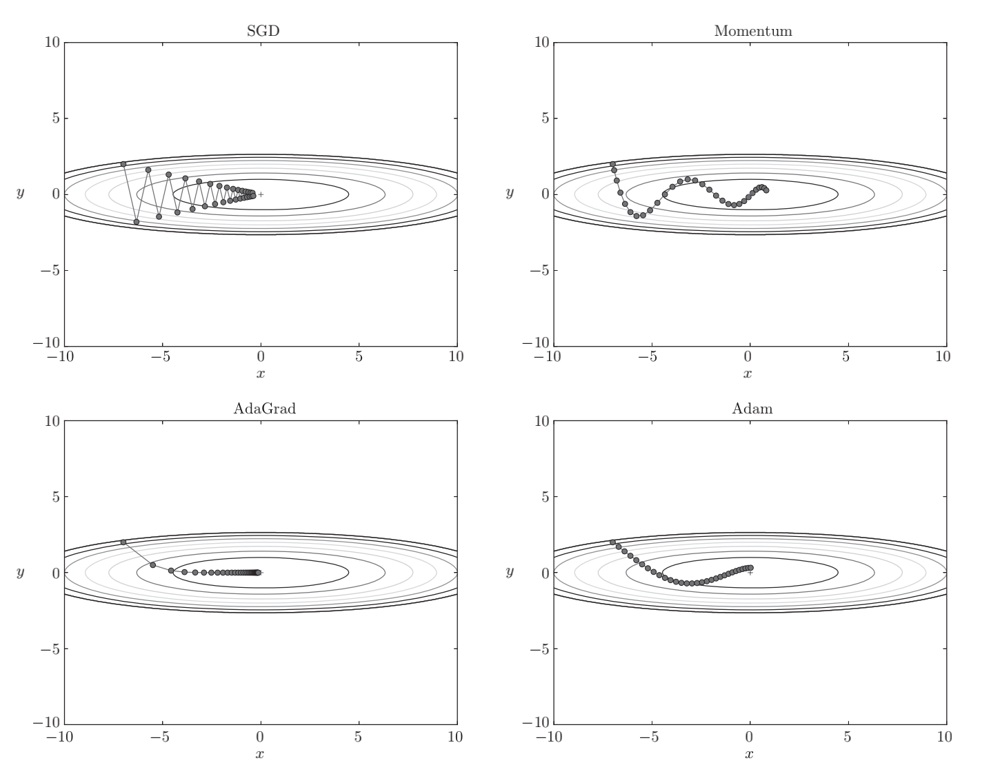
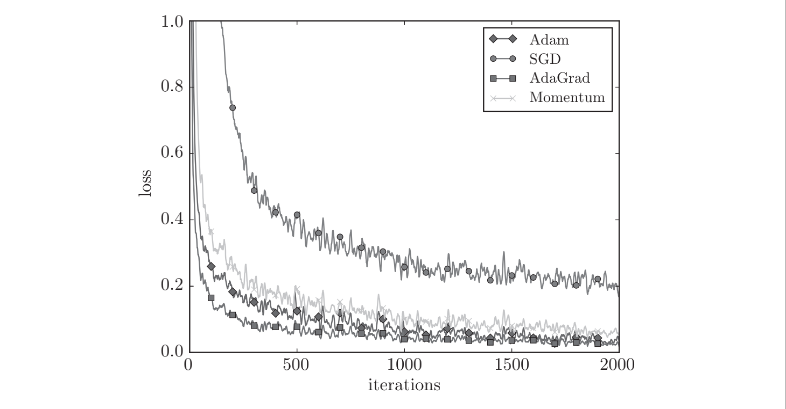
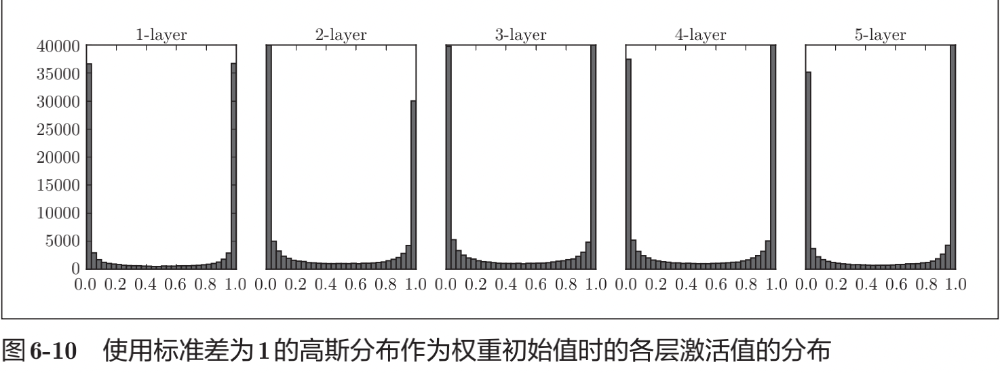
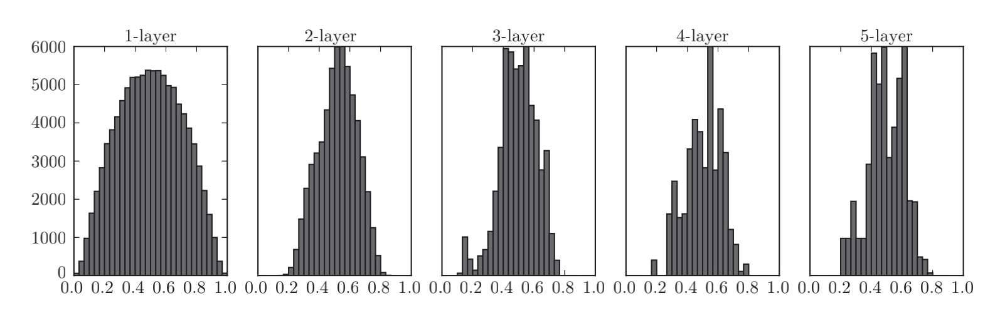
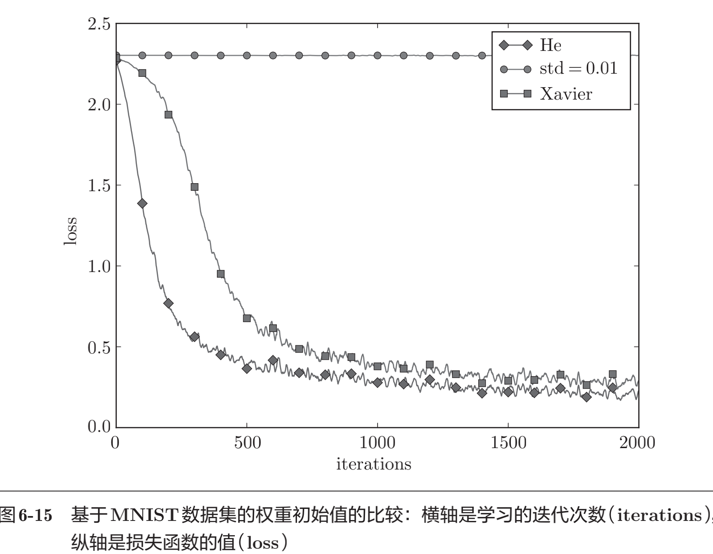

## Chapter6：与学习相关的技巧

### 一，参数的更新

* 1，最优化（optimization）：神经网络的学习的目的是找到使损失函数的值尽可能小的参数。这是寻找最优参数的问题，解决这个问题的过程称为最优化（optimization）。
* 2，随机梯度下降法（SGD）：我们将参数的梯度（导数）作为了线索。使用参数的梯度，沿梯度方向更新参数，并重复这个步骤多次，从而逐渐靠近最优参数，这个过程称为随机梯度下降法（stochastic gradient descent），简称SGD。

### 二，随机梯度下降法（SGD，stochastic gradient descent）

#### （一）python实现SGD

```py
class SGD:
    def __init__(self, lr=0.01):
        self.lr = lr
    def update(self, params, grads):
        for key in params.keys():
            params[key] -= self.lr * grads[key]
```

#### （二）SGD的缺点

* 1，如果函数的形状非均向（anisotropic），比如呈延伸状，搜索的路径就会非常低效。
* 2，SGD低效的根本原因是，梯度的方向并没有指向最小值的方向。

### 三，Momentum（动量）

#### （一）python实现Momentum（动量）

```py
class Momentum:
    def __init__(self, lr=0.01, momentum=0.9):
        self.lr = lr
        self.momentum = momentum
        self.v = None

    def update(self, params, grads):
        if self.v is None:
            self.v = {}
            for key, val in params.items():
                self.v[key] = np.zeros_like(val)
        for key in params.keys():
            self.v[key] = self.momentum*self.v[key] - self.lr*grads[key]
            params[key] += self.v[key]
```

#### （二）SGD VS Momentum

* 1，和SGD相比，我们发现“之”字形的“程度”减轻了。这是因为虽然x轴方向上受到的力非常小，但
  是一直在同一方向上受力，所以朝同一个方向会有一定的加速。
* 2，反过来，虽然y轴方向上受到的力很大，但是因为交互地受到正方向和反方向的力，它们会互相抵消，所以y轴方向上的速度不稳定。
* 3，因此，和SGD时的情形相比，可以更快地朝x轴方向靠近，减弱“之”字形的变动程度。

### 四，AdaGrad

#### （一）python实现AdaGrad

```py
class AdaGrad:
    def __init__(self, lr=0.01):
        self.lr = lr
        self.h = None
    def update(self, params, grads):
        if self.h is None:
            self.h = {}
            for key, val in params.items():
                self.h[key] = np.zeros_like(val)
        for key in params.keys():
            self.h[key] += grads[key] * grads[key]
            params[key] -= self.lr * grads[key] / (np.sqrt(self.h[key]) + 1e-7)
```

#### （二）AdaGrad优缺点

* 1，学习率衰减（learning rate decay）的方法，即随着学习的进行，使学习率逐渐减小。实际上，一开始“多”学，然后逐渐“少”学的方法，在神经网络的学习中经常被使用。

### 五，Adam

#### （一）Adam思路

* 1，Momentum参照小球在碗中滚动的物理规则进行移动，AdaGrad为参数的每个元素适当地调整更新步伐。如果将这两个方法融合在一起会怎么样呢？这就是Adam方法的基本思路。
* 2，它直观地讲，就是融合了Momentum和AdaGrad的方法。通过组合前面两个方法的优点，有望实现参数空间的高效搜索。此外，进行超参数的“偏置校正”也是Adam的特征。

#### （二）python实现Adam

```py
class Adam:
    def __init__(self, lr=0.001, beta1=0.9, beta2=0.999):
        self.lr = lr
        self.beta1 = beta1
        self.beta2 = beta2
        self.iter = 0
        self.m = None
        self.v = None
  
    def update(self, params, grads):
        if self.m is None:
            self.m, self.v = {}, {}
            for key, val in params.items():
                self.m[key] = np.zeros_like(val)
                self.v[key] = np.zeros_like(val)
  
        self.iter += 1
        lr_t  = self.lr * np.sqrt(1.0 - self.beta2**self.iter) / (1.0 - self.beta1**self.iter)   
  
        for key in params.keys():
            #self.m[key] = self.beta1*self.m[key] + (1-self.beta1)*grads[key]
            #self.v[key] = self.beta2*self.v[key] + (1-self.beta2)*(grads[key]**2)
            self.m[key] += (1 - self.beta1) * (grads[key] - self.m[key])
            self.v[key] += (1 - self.beta2) * (grads[key]**2 - self.v[key])
  
            params[key] -= lr_t * self.m[key] / (np.sqrt(self.v[key]) + 1e-7)
  
            #unbias_m += (1 - self.beta1) * (grads[key] - self.m[key]) # correct bias
            #unbisa_b += (1 - self.beta2) * (grads[key]*grads[key] - self.v[key]) # correct bias
            #params[key] += self.lr * unbias_m / (np.sqrt(unbisa_b) + 1e-7)
```

### 六，四种更新参数方法的比较



1. 与SGD相比，其他3种方法学习得更快，而且速度基本相同，AdaGrad的学习进行得稍微快一点。
2. 这个实验需要注意的地方是，实验结果会随学习率等超参数、神经网络的结构（几层深等）的不同而发生变化。
3. 一般而言，与SGD相比，其他3种方法可以学习得更快，有时最终的识别精度也更高。

### 七，权重的初始值

#### （一）将权重初始值设为0？

1. 权值衰减就是一种以减小权重参数的值为目的进行学习的方法。通过减小权重参数的值来抑制过拟合的发生。
2. 为什么不能将权重初始值设成一样的值呢？这是因为在误差反向传播法中，所有的权重值都会进行相同的更新。
3. 权重被更新为相同的值，并拥有了对称的值（重复的值）。这使得神经网络拥有许多不同的权重的意义丧失了。为了防止“权重均一化”（严格地讲，是为了瓦解权重的对称结构），必须随机生成初始值。

#### （二）隐藏层的激活值的分布

1. 偏向0和1的数据分布会造成反向传播中梯度的值不断变小，最后消失，这个问题称为梯度消失（gradient vanishing）。
2. 层次加深的深度学习中，梯度消失的问题可能会更加严重。
3. 各层的激活值的分布都要求有适当的广度。为什么呢？因为通过在各层间传递多样性的数据，神经网络可以进行高效的学习。反过来，如果传递的是有所偏向的数据，就会出现梯度消失或者“表现力受限”的问题，导致学习可能无法顺利进行。
4. 使用Xavier初始值作为权重初始值时的各层激活值的分布


#### （三）ReLU的权重初始值
##### 1，tanh函数和sigmoid函数
* 如果用tanh函数（双曲线函数）代替sigmoid函数，这个稍微歪斜的问题就能得到改善。实际上，使用tanh函数后，会呈漂亮的吊钟型分布。
* tanh函数和sigmoid函数同是S型曲线函数，但tanh函数是关于原点(0, 0)对称的S型曲线，而sigmoid函数是关于(x, y)=(0, 0.5)对称的S型曲线。
* 众所周知，用作激活函数的函数最好具有关于原点对称的性质。
  
##### 2，He初始值
* Xavier初始值是以激活函数是线性函数为前提而推导出来的。因为sigmoid函数和tanh函数左右对称，且中央附近可以视作线性函数，所以适合使用Xavier初始值。
* 但当激活函数使用ReLU时，一般推荐使用ReLU专用的初始值，也就是Kaiming He等人推荐的初始值，也称为“He初始值“
  
#### （四）基于MNIST数据集的权重初始值的比较

1. 这和刚才观察到的激活值的分布一样，是因为正向传播中传递的值很小（集中在0附近的数据）。因此，逆向传播时求到的梯度也很小，权重几乎不进行更新。
2. 相反，当权重初始值为Xavier初始值和He初始值时，学习进行得很顺利。并且，He初始值时的学习进度更快一些。
3. 综上，在神经网络的学习中，权重初始值非常重要。很多时候权重初始值的设定关系到神经网络的学习能否成功。

### 八，Batch Normalization
>Batch Normalization的思路是为了使各层拥有适当的广度，“强制性”地调整各层的激活值分布使其拥有适当的广度。
#### （一）Batch Normalization的算法
##### 1，Batch Norm有以下优点：
* 可以使学习快速进行（可以增大学习率）。
* 不那么依赖初始值（对于初始值不用那么神经质）。
* 抑制过拟合（降低Dropout等的必要性）。