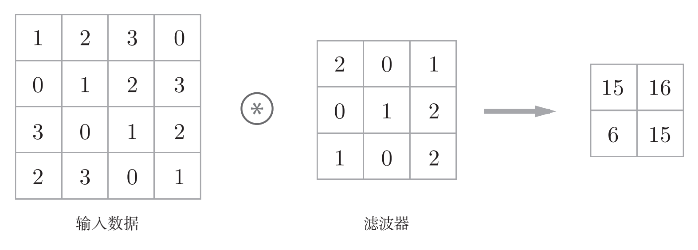
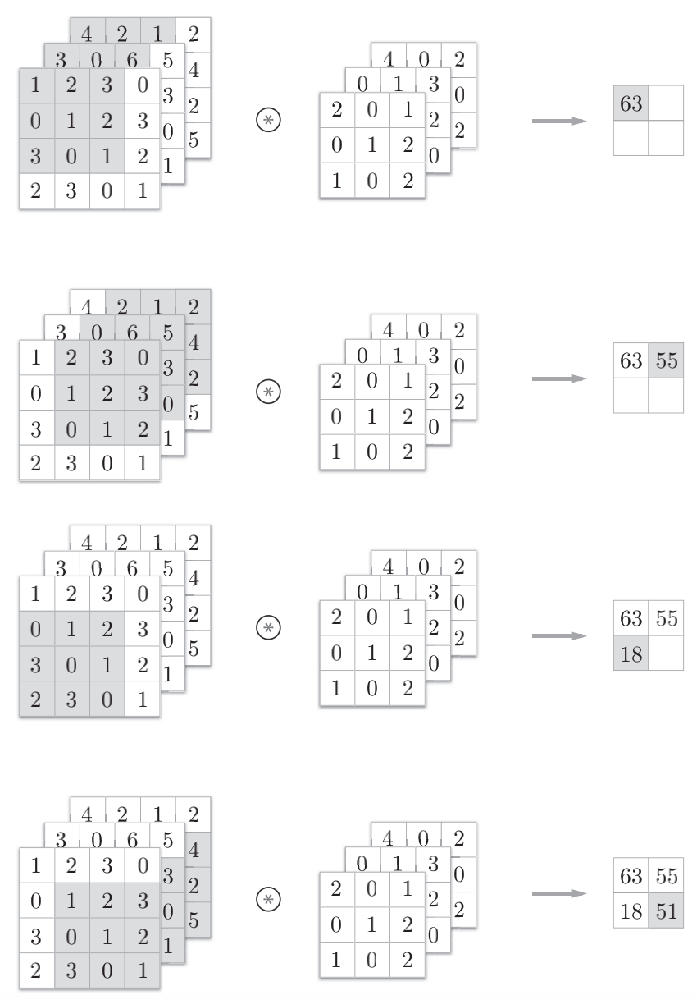
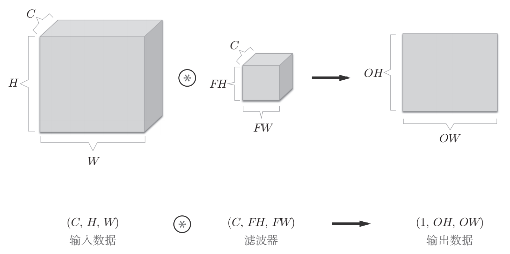
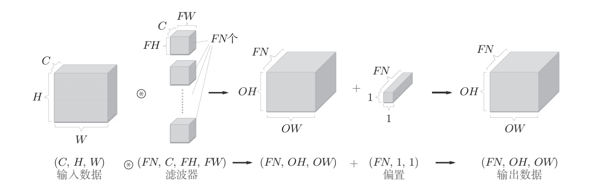
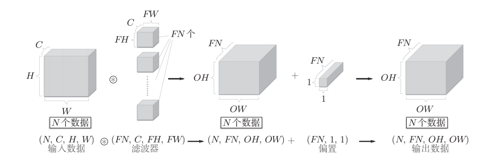
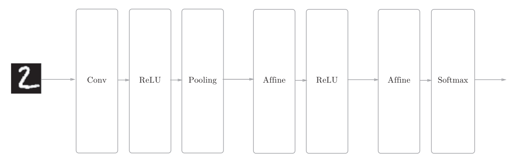

## Chapter7: 卷积神经网络（Convolutional Neural Network，CNN）
### 一，整体结构
* CNN中新出现了卷积层（Convolution层）和池化层（Pooling层）。
* 相邻层的所有神经元之间都有连接，这称为全连接（fully-connected）。
* 全连接的神经网络中，Affine层后面跟着激活函数ReLU层（或者Sigmoid层）。
* 这可以理解为之前的“Affine-ReLU”连接被替换成了“Convolution-ReLU-(Pooling)”连接。

### 二，卷积层
#### （一）全连接层存在什么问题
1. 那就是数据的形状被“忽视”了。比如，输入数据是图像时，图像通常是高、长、通道方向上的3维形状。但是，向全连接层输入时，需要将3维数据拉平为1维数据。
2. 图像是3维形状，这个形状中应该含有重要的空间信息。比如，空间上邻近的像素为相似的值、RBG的各个通道之间分别有密切的关联性、相距较远的像素之间没有什么关联等，3维形状中可能隐藏有值得提取的本质模式。但是，因为全连接层会忽视形状，将全部的输入数据作为相同的神经元（同一维度的神经元）处理，所以无法利用与形状相关的信息。
#### （二）卷积层优势
1. 卷积层可以保持形状不变。当输入数据是图像时，卷积层会以3维数据的形式接收输入数据，并同样以3维数据的形式输出至下一层。因此，在CNN中，可以（有可能）正确理解图像等具有形状的数据。
2. CNN中，有时将卷积层的输入输出数据称为特征图（feature map）。其中，卷积层的输入数据称为输入特征图（input feature map），输出数据称为输出特征图（output feature map）。
##### 1. 卷积运算

* 卷积层进行的处理就是卷积运算。卷积运算相当于图像处理中的“滤波器运算”。
* 卷积运算对输入数据应用滤波器。在这个例子中，输入数据是有高长方向的形状的数据，滤波器也一样，有高长方向上的维度。假设用（height, width）表示数据和滤波器的形状，则在本例中，输入大小是(4,4)，滤波器大小是(3, 3)，输出大小是(2, 2)。另外，有的文献中也会用“核”这个词来表示这里所说的“滤波器”。
* 对于输入数据，卷积运算以一定间隔滑动滤波器的窗口并应用。这里所说的窗口是指图7-4中灰色的3×3的部分。如图所示，将各个位置上滤波器的元素和输入的对应元素相乘，然后再求和（有时将这个计算称为乘积累加运算）。然后，将这个结果保存到输出的对应位置。将这个过程在所有位置都进行一遍，就可以得到卷积运算的输出。
* 在全连接的神经网络中，除了权重参数，还存在偏置。CNN中，滤波器的参数就对应之前的权重。并且，CNN中也存在偏置。
#### （三）填充（padding）与步幅（stride）
1. 在进行卷积层的处理之前，有时要向输入数据的周围填入固定的数据（比如0等），这称为填充（padding），是卷积运算中经常会用到的处理。
2. 通道数只能设定为和输入数据的通道数相同的值。
3. 应用滤波器的位置间隔称为步幅（stride）。
4. 当输出大小无法除尽时（结果是小数时），需要采取报错等对策。顺便说一下，根据深度学习的框架的不同，当值无法除尽时，有时会向最接近的整数四舍五入，不进行报错而继续运行。

#### （四）3维数据的卷积运算

* 需要注意的是，在3维数据的卷积运算中，输入数据和滤波器的通道数要设为相同的值。
  
#### （五）结合方块思考

1. 在这个例子中，数据输出是1张特征图。所谓1张特征图，换句话说，就是通道数为1的特征图。
2. 通过应用FN个滤波器，输出特征图也生成了FN个。如果将这FN个特征图汇集在一起，就得到了形状为(FN, OH, OW)的方块。将这个方块传给下一层，就是CNN的处理流。

#### （六）批处理
* 神经网络的处理中进行了将输入数据打包的批处理。之前的全连接神经网络的实现也对应了批处理，通过批处理，能够实现处理的高效化和学习时对mini-batch的对应。
* 批处理版的数据流中，在各个数据的开头添加了批用的维度。像这样，数据作为4维的形状在各层间传递。这里需要注意的是，网络间传递的是4维数据，对这N个数据进行了卷积运算。也就是说，批处理将N次的处理汇总成了1次进行。

### 三，池化层
>池化是缩小高、长方向上的空间的运算。
#### （一）池化层的特征
##### 池化层有以下特征：
* 没有要学习的参数
* * 池化层和卷积层不同，没有要学习的参数。池化只是从目标区域中取最大值（或者平均值），所以不存在要学习的参数。
* 通道数不发生变化
* * 经过池化运算，输入数据和输出数据的通道数不会发生变化。计算是按通道独立进行的。
* 对微小的位置变化具有鲁棒性（健壮）
* * 输入数据发生微小偏差时，池化仍会返回相同的结果。因此，池化对输入数据的微小偏差具有鲁棒性。
### 四，卷积层和池化层的实现
#### 1. 4维数组
* 如果要访问第1个数据，只要写x[0]就可以了（注意Python的索引是从0开始的）。同样地，用x[1]可以访问第2个数据。
#### 2. 基于im2col的展开
>im2col这个名称是“image to column”的缩写，翻译过来就是“从图像到矩阵”的意思。
* 如果老老实实地实现卷积运算，估计要重复好几层的for语句。这样的实现有点麻烦，而且，NumPy中存在使用for语句后处理变慢的缺点（NumPy中，访问元素时最好不要用for语句）。这里，我们不使用for语句，而是使用im2col这个便利的函数进行简单的实现。
* im2col是一个函数，将输入数据展开以适合滤波器（权重）。如图7-17所示，对3维的输入数据应用im2col后，数据转换为2维矩阵（正确地讲，是把包含批数量的4维数据转换成了2维数据）。
* 使用im2col的实现存在比普通的实现消耗更多内存的缺点。但是，汇总成一个大的矩阵进行计算，对计算机的计算颇有益处。比如，在矩阵计算的库（线性代数库）等中，矩阵计算的实现已被高度最优化，可以高速地进行大矩阵的乘法运算。因此，通过归结到矩阵计算上，可以有效地利用线性代数库。
#### 3. 卷积层的实现
~~~py
class Convolution:
    def __init__(self, W, b, stride=1, pad=0):
        self.W = W
        self.b = b
        self.stride = stride
        self.pad = pad
    def forward(self, x):
        FN, C, FH, FW = self.W.shape
        N, C, H, W = x.shape
        out_h = int(1 + (H + 2*self.pad - FH) / self.stride)
        out_w = int(1 + (W + 2*self.pad - FW) / self.stride)
        col = im2col(x, FH, FW, self.stride, self.pad)
        col_W = self.W.reshape(FN, -1).T # 滤波器的展开
        out = np.dot(col, col_W) + self.b
        out = out.reshape(N, out_h, out_w, -1).transpose(0, 3, 1, 2)
        return out
~~~
### 五，手写数字识别CNN的实现

#### python实现手写数字识别CNN
~~~py
class SimpleConvNet:
    def __init__(self, input_dim=(1, 28, 28), 
                 conv_param={'filter_num':30, 'filter_size':5, 'pad':0, 'stride':1},
                 hidden_size=100, output_size=10, weight_init_std=0.01):
        filter_num = conv_param['filter_num']
        filter_size = conv_param['filter_size']
        filter_pad = conv_param['pad']
        filter_stride = conv_param['stride']
        input_size = input_dim[1]
        conv_output_size = (input_size - filter_size + 2*filter_pad) / filter_stride + 1
        pool_output_size = int(filter_num * (conv_output_size/2) * (conv_output_size/2))

        # 初始化权重
        self.params = {}
        self.params['W1'] = weight_init_std * \
                            np.random.randn(filter_num, input_dim[0], filter_size, filter_size)
        self.params['b1'] = np.zeros(filter_num)
        self.params['W2'] = weight_init_std * \
                            np.random.randn(pool_output_size, hidden_size)
        self.params['b2'] = np.zeros(hidden_size)
        self.params['W3'] = weight_init_std * \
                            np.random.randn(hidden_size, output_size)
        self.params['b3'] = np.zeros(output_size)

        # 生成层
        self.layers = OrderedDict()
        self.layers['Conv1'] = Convolution(self.params['W1'], self.params['b1'],
                                           conv_param['stride'], conv_param['pad'])
        self.layers['Relu1'] = Relu()
        self.layers['Pool1'] = Pooling(pool_h=2, pool_w=2, stride=2)
        self.layers['Affine1'] = Affine(self.params['W2'], self.params['b2'])
        self.layers['Relu2'] = Relu()
        self.layers['Affine2'] = Affine(self.params['W3'], self.params['b3'])

        self.last_layer = SoftmaxWithLoss()

    def predict(self, x):
        for layer in self.layers.values():
            x = layer.forward(x)

        return x

    def loss(self, x, t):
        """求损失函数
        参数x是输入数据、t是教师标签
        """
        y = self.predict(x)
        return self.last_layer.forward(y, t)
~~~
### 六，CNN的可视化
#### 基于分层结构的信息提取
* 如果堆叠了多层卷积层，则随着层次加深，提取的信息也愈加复杂、抽象，这是深度学习中很有意思的一个地方。
* 最开始的层对简单的边缘有响应，接下来的层对纹理有响应，再后面的层对更加复杂的物体部件有响应。
* 也就是说，随着层次加深，神经元从简单的形状向“高级”信息变化。换句话说，就像我们理解东西的“含义”一样，响应的对象在逐渐变化。